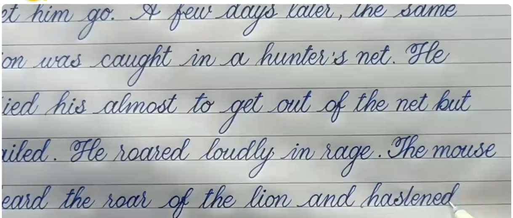
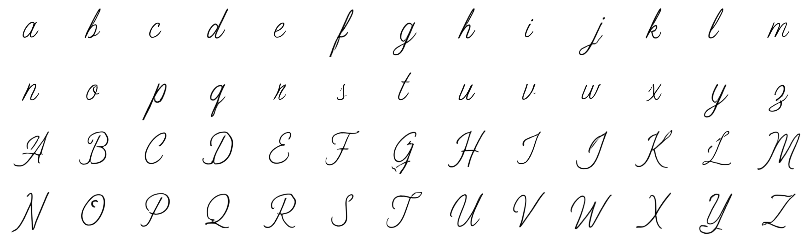
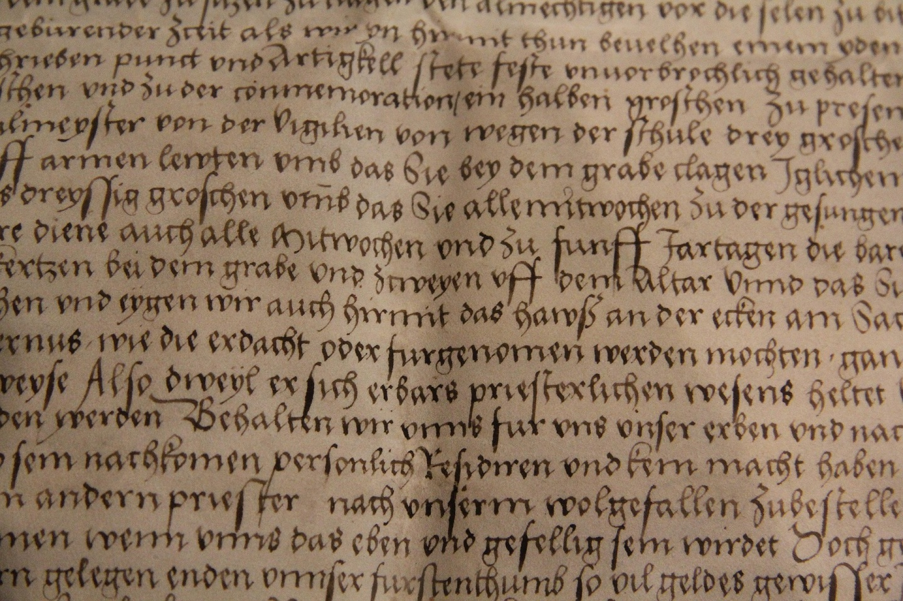
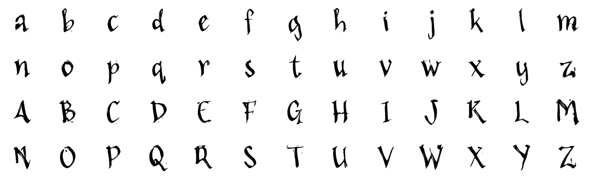
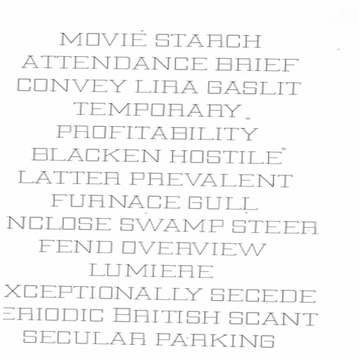
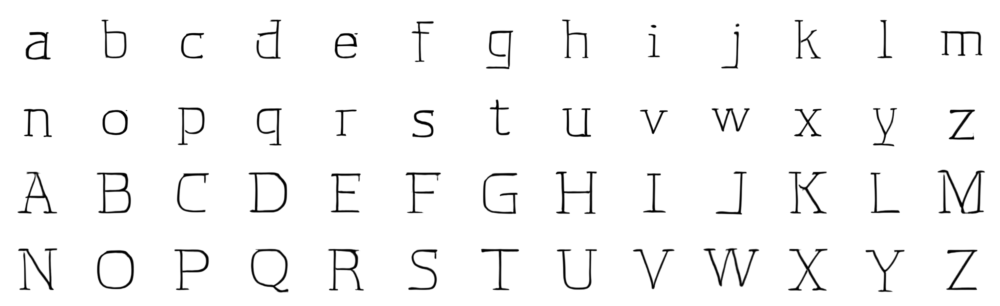
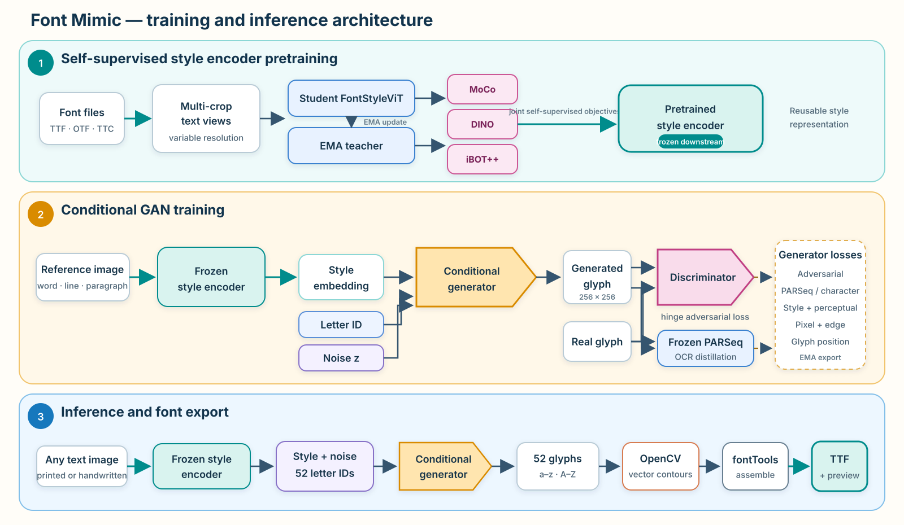

<div align="center">

# Font Mimic

### 输入任意文字图片，生成风格相似的英文字母，并可直接组装为 TTF 字体。

**简体中文** · [English](README.md)


</div>

Font Mimic 从完整文字图片中提取可复用的字体风格表示，再生成该风格下的 52 个英文大小写字母。参考图既可以来自 TTF/OTF 字体渲染，也可以是手写字照片；内容可以是单个字母、单词、句子，甚至整段文字。生成的栅格字形还可以自动描摹轮廓并组装成可安装的 TrueType 字体。

> 本项目代码主要在 [OpenAI Codex](https://openai.com/codex/) 中完成。

> [!NOTE]
> 当前版本仅支持 `a-z` 与 `A-Z`。后续可考虑加入数字、标点，甚至中文字符。仓库不包含训练好的模型权重，运行导出前需要完成下述两阶段训练。

## 效果展示

模型直接从完整参考图中读取风格，不要求事先切分单字。

<table>
  <tr><th width="34%">参考图</th><th width="66%">生成的字母表</th></tr>
  <tr><td></td><td></td></tr>
  <tr><td></td><td></td></tr>
  <tr><td></td><td></td></tr>
</table>

更多效果可在 [`assets/`](assets/) 中查看。

## 项目优势

- **数据集构建简单。** 只需收集许可证允许商用的公开字体文件，并在训练时动态渲染文字图。根据本项目实践，清洗后的约 1,000–2,000 款字体已经可以取得不错效果。数据清洗不可忽略：应移除损坏文件、缺字字体、重复字体，并特别检查大小写几乎没有区别的字体。
- **参考图形式自由。** 输入可以是字母、单词、句子或段落；印刷字体渲染图与手写字照片使用同一条推理流程。
- **模型轻量、生成速度快。** 字形生成器基于条件 GAN，一次前向计算即可批量生成，不需要扩散模型的多步迭代采样，也不依赖大语言模型的自回归解码。
- **自带字体导出。** 流程会生成 52 张字形图，使用 OpenCV 提取轮廓，通过 fontTools 写入 TTF，并重新加载字体渲染验证样张。

## 算法架构



系统包含两个训练阶段和一个导出阶段：

1. **字体风格编码器预训练 — `train_font_style.py`。** 可变分辨率 `FontStyleViT` 通过多裁剪文字视图进行 Student/EMA Teacher 自监督训练。损失由 MoCo 队列对比学习、DINO 跨视图自蒸馏和 iBOT++ patch 蒸馏组成；其中 iBOT++ 同时监督被遮挡和可见的有效 patch。
2. **字形生成模型训练 — `train.py`。** 冻结的风格编码器输出风格表示，与目标字母 ID 和随机噪声一起送入条件 GAN 生成器。训练包含 hinge 对抗损失、冻结 PARSeq 的 OCR logits 蒸馏、像素/前景损失、边缘损失、风格与 patch 感知损失，以及可选的字形位置回归；最终导出 EMA 生成器。
3. **推理与字体导出 — `generate_font.py`。** 每张参考图只需编码一次，生成器依次输出 `a-z` 与 `A-Z`；随后由 OpenCV 将栅格笔画转换为轮廓，并由 fontTools 生成 TTF 和预览图。

## 快速开始

### 1. 安装依赖

请先创建独立 Python 环境并安装与你的 CUDA 环境匹配的 PyTorch，然后执行：

```bash
pip install -r requirements.txt
```

默认生成模型配置会通过 Torch Hub 加载官方 PARSeq。离线环境可先在本地克隆 PARSeq，再在 `config/train.yaml` 中设置 `model.parseq.repo_or_dir`，并将 `model.parseq.source` 改为 `local`。

### 2. 准备字体数据集

将两份训练配置中的 `dataset.font_root_path` 指向如下目录：

```text
fonts_dataset/
├── font/
│   ├── font_0001.ttf
│   ├── font_0002.otf
│   └── ...
└── wordlist.txt
```

请确保字体许可证允许你的预期用途。训练前应检查字形覆盖率，并移除损坏文件、重复字体、符号字体，以及大小写设计没有明显区别的字体。仓库内配置保留了示例绝对路径，运行前必须替换为本机路径。

### 3. 训练字体风格编码器

```bash
python train_font_style.py --config config/train_font_style.yaml
```

启动入口：[`train_font_style.py`](train_font_style.py)  
默认配置：[`config/train_font_style.yaml`](config/train_font_style.yaml)

训练完成后，将对应 checkpoint 写入 `config/train.yaml` 的 `model.style_encoder.checkpoint`。

### 4. 训练条件 GAN 生成模型

```bash
python train.py --config config/train.yaml
```

启动入口：[`train.py`](train.py)  
默认配置：[`config/train.yaml`](config/train.yaml)

训练过程会保存常规 checkpoint，并在配置的输出目录生成用于推理的 EMA 权重 `font_generator.pt`。

### 5. 生成字形并导出 TTF

将一张或多张参考图放入同一目录，然后执行：

```bash
python generate_font.py \
  --input references \
  --checkpoint outputs/font_cgan_parseq/font_generator.pt \
  --config outputs/font_cgan_parseq/resolved_config.yaml \
  --style-checkpoint outputs/font_style_vit/checkpoints/latest.pt \
  --output outputs/generated_fonts \
  --family-name "My Mimic Font"
```

`generate_font.py` 默认递归处理输入目录。典型输出结构如下：

```text
outputs/generated_fonts/
├── reference_1.ttf
├── batch_summary.json
└── reference_1_assets/
    ├── alphabet_grid.png
    ├── font_preview.png
    ├── specimen.png
    ├── metadata.json
    └── glyphs/
        ├── U0061.png
        └── ...
```

详细导出参数、轮廓调节方法及故障排查请参阅 [`GENERATE_FONT_ZH.md`](GENERATE_FONT_ZH.md)。

## 当前限制与后续方向

- 目前只生成 52 个 ASCII 英文字母；尚不支持数字、标点、kerning 字偶距和非拉丁文字。
- 字体基线、左右留白、轮廓简化等排版度量由栅格输出估计。导出的 TTF 可以直接使用，但无法完整恢复专业字体中的 kerning 和 hinting。
- 浅色纯净背景上的深色文字最接近训练分布；复杂场景照片可能需要预处理。
- 效果高度依赖字体数据的许可证、覆盖范围、清洗质量和训练权重质量。

## 引用与致谢

字体风格编码器的训练目标和文字识别监督参考了以下工作：

- **MoCo：** He 等，*Momentum Contrast for Unsupervised Visual Representation Learning* — [论文](https://arxiv.org/abs/1911.05722) · [官方代码](https://github.com/facebookresearch/moco)
- **DINO：** Caron 等，*Emerging Properties in Self-Supervised Vision Transformers* — [论文](https://arxiv.org/abs/2104.14294) · [官方代码](https://github.com/facebookresearch/dino)
- **iBOT：** Zhou 等，*iBOT: Image BERT Pre-Training with Online Tokenizer* — [论文](https://arxiv.org/abs/2111.07832) · [官方代码](https://github.com/bytedance/ibot)
- **iBOT++：** Cao 等，*TIPSv2: Advancing Vision-Language Pretraining with Enhanced Patch-Text Alignment* — [论文](https://arxiv.org/abs/2604.12012) · [项目主页与代码](https://gdm-tipsv2.github.io/)
- **PARSeq：** Bautista 与 Atienza，*Scene Text Recognition with Permuted Autoregressive Sequence Models* — [论文](https://arxiv.org/abs/2207.06966) · [官方代码](https://github.com/baudm/parseq)

如果你基于本项目发表研究工作，请根据实际使用情况引用上述原始论文。
